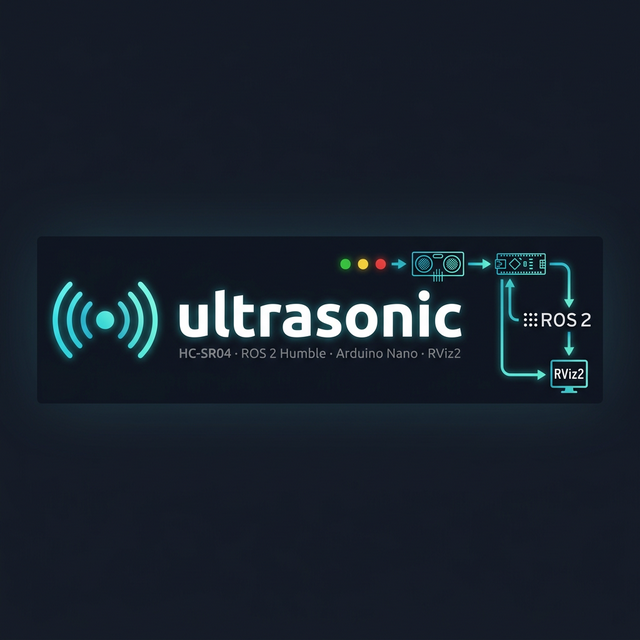

<p align="center">
  
</p>

<h1 align="center">🔊 ultrasonic</h1>

<p align="center">
  <strong>HC-SR04 Ultrasonic Sensor → ROS 2 Humble → RViz2</strong><br/>
  Real-time distance sensing over Arduino serial with live terminal readout, ROS topics, TF2 transforms, and colour-coded RViz2 markers.
</p>

```
  ██╗   ██╗██╗  ████████╗██████╗  █████╗ ███████╗ ██████╗ ███╗   ██╗██╗  ██████╗
  ██║   ██║██║  ╚══██╔══╝██╔══██╗██╔══██╗██╔════╝██╔═══██╗████╗  ██║██║ ██╔════╝
  ██║   ██║██║     ██║   ██████╔╝███████║███████╗██║   ██║██╔██╗ ██║██║ ██║
  ██║   ██║██║     ██║   ██╔══██╗██╔══██║╚════██║██║   ██║██║╚██╗██║██║ ██║
  ╚██████╔╝███████╗██║   ██║  ██║██║  ██║███████║╚██████╔╝██║ ╚████║██║ ╚██████╗
   ╚═════╝ ╚══════╝╚═╝   ╚═╝  ╚═╝╚═╝  ╚═╝╚══════╝ ╚═════╝ ╚═╝  ╚═══╝╚═╝  ╚═════╝

  HC-SR04 · Arduino Nano · ROS 2 Humble · RViz2
```

---

## ✨ Features

| Feature | Details |
|---|---|
| 📡 **Live Serial Bridge** | Reads `DIST:xxx.xx\n` frames from Arduino Nano at 20 Hz via `/dev/ttyUSB0` |
| 📢 **ROS 2 Topics** | Publishes `sensor_msgs/Range` and `std_msgs/Float32` with `BEST_EFFORT` QoS |
| 🗺️ **TF2 Transform** | Broadcasts `base_link → ultrasonic_link` at sensor position |
| 🎨 **RViz2 Markers** | Colour-coded cone + text label: 🟢 Safe / 🟡 Caution / 🔴 Danger |
| 📏 **On-demand Client** | Interactive CLI to request single readings at any time |
| 🔄 **Auto-reconnect** | Serial port reconnects automatically on disconnect |
| 🖥️ **Terminal Dashboard** | Live colour-coded ASCII bar chart in the terminal |

---

## 📐 System Architecture

```
┌─────────────────────────────────────────────────────────────┐
│                        Hardware Layer                        │
│   HC-SR04 ──TRIG/ECHO──► Arduino Nano ──USB Serial──► PC    │
│  (TRIG: D9, ECHO: D10)      115200 baud  "DIST:xx.xx\n"     │
└──────────────────────────────┬──────────────────────────────┘
                               │
┌──────────────────────────────▼──────────────────────────────┐
│                    ultrasonic_node (ROS 2)                   │
│  • Reads serial  • Parses DIST frames  • Re-connects         │
│  Publishes:                                                  │
│    /ultrasonic/range      → sensor_msgs/Range                │
│    /ultrasonic/distance_m → std_msgs/Float32                 │
│  Broadcasts TF:                                              │
│    base_link → ultrasonic_link                               │
└───────────┬──────────────────────────┬────────────────────--┘
            │                          │
┌───────────▼──────────┐  ┌────────────▼──────────────────────┐
│   rviz_marker_node   │  │        measure_client              │
│ Subscribes /range    │  │ On-demand single distance query    │
│ Publishes /markers   │  │ Interactive CLI (type 'measure')   │
│ Cone + Text in RViz2 │  └────────────────────────────────────┘
└──────────────────────┘
```

---

## 📦 Package Structure

```
ultrasonic/
├── arduino/
│   └── ultrasonic_sensor.ino   # Arduino Nano sketch (20 Hz, 115200 baud)
├── launch/
│   └── ultrasonic_launch.py    # Launch: ultrasonic_node + rviz_marker_node
├── rviz/
│   └── ultrasonic.rviz         # Pre-configured RViz2 layout
├── ultrasonic/
│   ├── __init__.py
│   ├── ultrasonic_node.py      # Main serial → ROS bridge
│   ├── rviz_marker_node.py     # Range → RViz2 marker publisher
│   └── measure_client.py       # On-demand measurement CLI
├── package.xml
├── setup.py
└── README.md
```

---

## 🔌 Hardware Setup

### Wiring (HC-SR04 → Arduino Nano)

| HC-SR04 Pin | Arduino Nano Pin |
|-------------|-----------------|
| `VCC`       | `5V`            |
| `GND`       | `GND`           |
| `TRIG`      | `D9`            |
| `ECHO`      | `D10`           |

> **Note:** Connect the Arduino to your PC via USB. The default serial port is `/dev/ttyUSB0`. Use `ls /dev/ttyUSB*` or `ls /dev/ttyACM*` to verify.

### Grant Serial Port Permission (one-time)

```bash
sudo usermod -aG dialout $USER
# Log out and back in, or run:
newgrp dialout
```

---

## 🚀 Quick Start

### 1 — Flash the Arduino

Open `arduino/ultrasonic_sensor.ino` in the Arduino IDE and upload to your Arduino Nano.

### 2 — Build the ROS 2 Package

```bash
cd ~/ultrasonic        # your workspace root
colcon build --packages-select ultrasonic
source install/setup.bash
```

### 3 — Launch All Nodes

```bash
ros2 launch ultrasonic ultrasonic_launch.py
```

The terminal will show a live colour-coded bar chart of distance readings.

### 4 — Open RViz2 (Optional)

```bash
rviz2 -d ~/ultrasonic/src/ultrasonic/rviz/ultrasonic.rviz
```

### 5 — On-Demand Measurement (Optional)

In a separate terminal:

```bash
source ~/ultrasonic/install/setup.bash
ros2 run ultrasonic measure_client
```

Then type `measure` (or `m`) and press Enter to get a single reading.

---

## ⚙️ Parameters

All parameters can be passed via the launch file or command line:

| Parameter      | Type    | Default            | Description                                     |
|----------------|---------|--------------------|------------------------------------------------|
| `serial_port`  | `str`   | `/dev/ttyUSB0`     | Serial device path (`/dev/ttyACM0` on some boards) |
| `baud_rate`    | `int`   | `115200`           | Must match the Arduino sketch                   |
| `frame_id`     | `str`   | `ultrasonic_link`  | TF frame for the sensor                         |
| `parent_frame` | `str`   | `base_link`        | TF parent frame                                 |
| `sensor_x`     | `float` | `0.05`             | Sensor X offset from parent (metres)            |
| `sensor_y`     | `float` | `0.0`              | Sensor Y offset from parent (metres)            |
| `sensor_z`     | `float` | `0.05`             | Sensor Z offset from parent (metres)            |

### Override at Launch

```bash
ros2 launch ultrasonic ultrasonic_launch.py \
  serial_port:=/dev/ttyACM0 \
  baud_rate:=9600
```

---

## 📡 ROS 2 Interface

### Published Topics

| Topic                       | Message Type              | QoS          | Description                          |
|-----------------------------|---------------------------|--------------|--------------------------------------|
| `/ultrasonic/range`         | `sensor_msgs/Range`       | BEST_EFFORT  | Full range message with FOV metadata |
| `/ultrasonic/distance_m`    | `std_msgs/Float32`        | BEST_EFFORT  | Plain distance in metres             |
| `/ultrasonic/markers`       | `visualization_msgs/MarkerArray` | Reliable | RViz2 cone + text label       |

### Subscribed Topics

| Topic               | Message Type        | Node               |
|---------------------|---------------------|--------------------|
| `/ultrasonic/range` | `sensor_msgs/Range` | `rviz_marker_node` |
| `/ultrasonic/range` | `sensor_msgs/Range` | `measure_client`   |

### TF Frames

```
base_link  ──►  ultrasonic_link
```

---

## 🎨 Distance Thresholds & Colour Scheme

| Zone      | Range      | Terminal     | RViz2 Cone   |
|-----------|------------|--------------|--------------|
| 🔴 Danger | < 30 cm    | Red bar `⚠`  | Red (0.3 α)  |
| 🟡 Caution| 30–100 cm  | Yellow bar `⚡`| Yellow→Orange|
| 🟢 Safe   | > 100 cm   | Green bar `✔` | Green (0.3 α)|

---

## 🛠️ Serial Protocol

The Arduino sketch sends newline-terminated ASCII frames at **20 Hz**:

| Frame                   | Meaning                          |
|-------------------------|----------------------------------|
| `DIST:123.45\n`         | Distance in centimetres (float)  |
| `DIST:OUT_OF_RANGE\n`   | Echo timeout or distance > 400 cm |
| `DIST:TOO_CLOSE\n`      | Distance < 2 cm                  |

---

## 🐛 Troubleshooting

| Symptom | Likely Cause | Fix |
|---|---|---|
| `Cannot open /dev/ttyUSB0` | Permission denied or wrong port | `sudo usermod -aG dialout $USER` and re-login |
| No data received (measure_client) | `ultrasonic_node` not running | Run the launch file first |
| RViz2 shows no markers | Topic mismatch / wrong QoS | Check `/ultrasonic/range` with `ros2 topic echo` |
| All readings `OUT_OF_RANGE` | Wiring issue or TRIG/ECHO swap | Re-check D9→TRIG, D10→ECHO |
| Noisy / jumping readings | 5V power supply insufficient | Use external 5V supply for HC-SR04 |

---

## 📋 Dependencies

```xml
<depend>rclpy</depend>
<depend>sensor_msgs</depend>
<depend>std_msgs</depend>
<depend>geometry_msgs</depend>
<depend>visualization_msgs</depend>
<depend>tf2_ros</depend>
<exec_depend>launch</exec_depend>
<exec_depend>launch_ros</exec_depend>
```

Python: `pyserial` (`pip install pyserial` or `install_requires` in `setup.py`)

---

## 📄 License

Distributed under the **Apache 2.0 License**. See [`LICENSE`](LICENSE) for details.

---

---

## ⭐ Support This Project

If this package saved you time or helped your robot see the world — show some love!

<p align="center">
  <a href="https://github.com/dk">
    
  </a>
  &nbsp;&nbsp;
  <a href="https://github.com/dk">
    
  </a>
</p>

> 💡 **If you found this useful, please ⭐ star the repository and follow me on GitHub — it really helps and motivates me to keep building open-source robotics tools!**

---

<p align="center">
  Built with ❤️ for ROS 2 Humble · HC-SR04 · Arduino Nano<br/>
  <sub>Created by <strong>Dilip Kumar</strong></sub>
</p>
